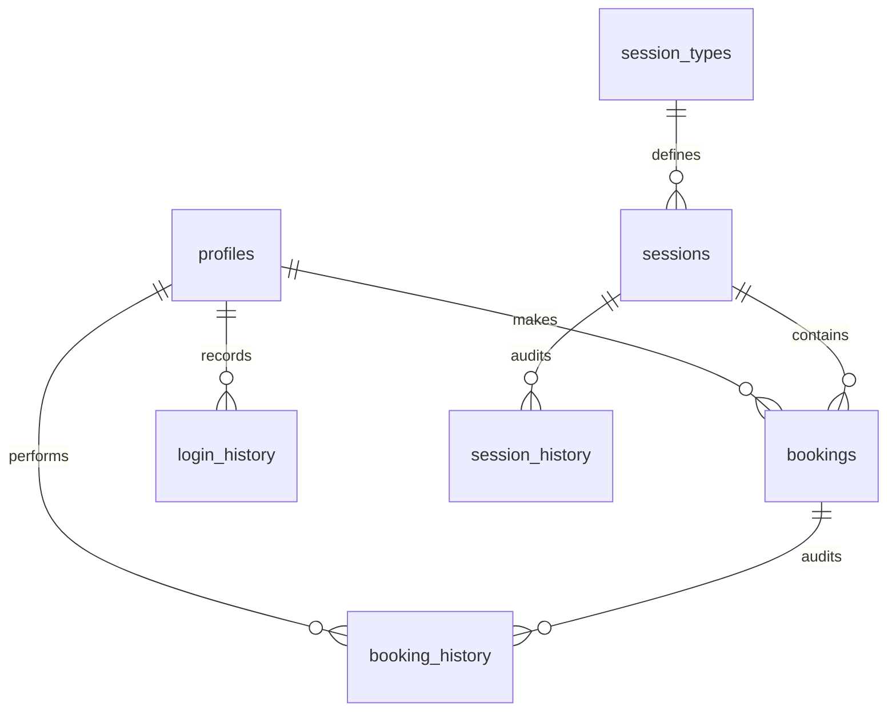

# Implementation Plan: Backend & Dashboards for Aria Fertility Clinic

This document outlines the comprehensive, step-by-step implementation plan to integrate a high-end **Supabase backend**, **User/Patient Portals**, and **Clinical Admin Dashboards** into the existing **Aria Fertility Clinic** Next.js website. 

In alignment with the elite, tranquil, and luxurious clinical experience of the main clinic in Marylebone, London, this system is designed to provide seamless clinical booking flows, highly secure patient health logs, clear audit trails, and reassuring aesthetics.

---

## 📖 Executive Summary
We will transition the current static Next.js frontend into a fully dynamic web application powered by **Supabase**. Key highlights of the implementation include:
*   **Elegant Clinical Portals**: Separate, secure, and beautiful dashboard panels for **Admin (Clinical Directors/Consultants)**, **Patients (Active/Registered)**, and **General Users (Enquirers)**.
*   **Supabase Engine**: Full integration of Supabase Auth, PostgreSQL, Row-Level Security (RLS) policies, and database triggers.
*   **Clinician Calendar Engine**: Advanced slot rules, custom ongoing schedule parameters, and specific single-date clinical exception tracking.
*   **Automatic Patient Onboarding & Status Triggers**: 
    *   Real-time role upgrading from `user` to `patient` upon booking their first assessment.
    *   Automatic fallback to the `cancelled_patient` role status if all their bookings are cancelled before a session takes place.
*   **Manual Booking Approvals**: All requested bookings enter a `'pending'` status by default, ensuring administrators review and approve appointments before they are confirmed.
*   **Immutable Clinical Auditing**: Comprehensive history logging for patient logins, booking changes, and clinician schedule modifications.
*   **Premium Visual Experience**: Clean luxury UI utilizing the brand's signature fonts, gold/teal accents, soft grain overlays, top-left micro-toasts, and dedicated slug pages rather than cluttered modals.

---

## 🎨 1. Clinical Rebranding & Aesthetic System

To ensure that the new dashboard interfaces feel like a premium, comforting extension of the main Aria Fertility landing page, we will strictly adhere to the established design tokens:

### A. The Core Color Palette
*   **Aria Teal (`#72A9B5`)**: The primary brand color. Conveys safety, medical authority, cleanliness, and reassurance. Used for active navigation states, primary buttons, and clinical timelines.
*   **Aria Gold (`#C9B07D`)**: The secondary brand accent. Conveys luxury, hope, warmth, and premium care. Used for subtle highlights, badges, and high-priority call-to-actions.
*   **Aria Beige (`#F2F0ED` / `var(--background)`)**: The calming, low-contrast clinical background. Prevents the "cold hospital" feel.
*   **Aria Dark (`#7A7A7A`)**: Sleek, professional slate neutral for text hierarchy and secondary status elements.

### B. Custom CSS & Visual Accents
*   **The Grain Overlay**: The signature `grain-overlay` will cover all dashboard views to maintain consistent depth:
    ```css
    .grain-overlay {
      position: fixed;
      pointer-events: none;
      z-index: 9999;
      opacity: 0.03;
      background-image: url("data:image/svg+xml,...");
    }
    ```
*   **Aria Glass Glow & Premium Shadows**:
    *   Standard card containers: `premium-glass` with dynamic backdrops (`backdrop-blur-xl border border-white/30`).
    *   Hover states: `aria-glass-glow` showing a gentle teal tint shadow:
        ```css
        box-shadow: inset 0 0 20px rgba(114, 169, 181, 0.1), 0 8px 32px 0 rgba(114, 169, 181, 0.15);
        ```

### C. UX & UI Interaction Principles
1.  **Top-Left Screen Toasts**: All operational toast alerts (e.g. *"Request Submitted"*, *"Profile Updated"*) will animate in smoothly from the **top-left** of the screen (custom styled with soft background blurs, avoiding default jarring alert colors).
2.  **No Cluttered Modals**: Unique pages with slugs (e.g., `/patient/bookings/[id]`) will be used to show detailed booking summaries, patient instructions, or clinician notes. Modals will be reserved exclusively for immediate, destructive, or brief actions:
    *   *Modals*: Booking cancellation confirmation, quick clinical field overrides, session template deletion.
    *   *Slug Pages*: Booking detail files, clinical treatment files, settings portals.
3.  **Typographical Hierarchy**:
    *   Serif Headers: `Cormorant Garamond` (classic, boutique luxury).
    *   Sans-serif Controls: `Montserrat` (contemporary, crisp clinical layouts).

---

## 🗄️ 2. Supabase Database Schema Design

We will configure a PostgreSQL database on Supabase using custom triggers, foreign key constraints, and performance indexes.



### A. Profiles Table (`profiles`)
Extends the basic `auth.users` table with clinic-specific demographic controls, status configurations, and user roles.
```sql
CREATE TYPE user_role AS ENUM ('user', 'patient', 'cancelled_patient', 'admin');
CREATE TYPE user_status AS ENUM ('active', 'rejected', 'banned');

CREATE TABLE profiles (
    id UUID PRIMARY KEY REFERENCES auth.users(id) ON DELETE CASCADE,
    first_name TEXT NOT NULL,
    last_name TEXT NOT NULL,
    email TEXT UNIQUE NOT NULL,
    phone TEXT,
    role user_role DEFAULT 'user'::user_role,
    status user_status DEFAULT 'active'::user_status,
    rejection_reason TEXT,
    created_at TIMESTAMPTZ DEFAULT CURRENT_TIMESTAMP NOT NULL,
    updated_at TIMESTAMPTZ DEFAULT CURRENT_TIMESTAMP NOT NULL
);
```

### B. Session Types Table (`session_types`)
Stores the clinical offerings templates (with starting templates such as `one-on-one` consultations, `group` information sessions, and fertility `workshops`). Importantly, these must **not** be defined as static database enums, but rather as options to be created, read, updated, and deleted (CRUD) in a dedicated table so that the clinical admin has total autonomy to define and expand their own types of sessions at any time.
```sql
CREATE TABLE session_types (
    id UUID DEFAULT gen_random_uuid() PRIMARY KEY,
    title TEXT NOT NULL,
    slug TEXT UNIQUE NOT NULL,
    description TEXT NOT NULL,
    duration_minutes INTEGER NOT NULL,
    category TEXT NOT NULL, -- 'Consultation', 'Scan', 'Therapy', 'Assessment'
    pricing NUMERIC(10, 2), -- Internal reference fee (no online payment)
    max_slots INTEGER DEFAULT 1 NOT NULL, -- Usually 1 for personalized care
    location TEXT NOT NULL, -- 'Marylebone Clinic', 'Virtual Consult'
    is_active BOOLEAN DEFAULT TRUE NOT NULL,
    created_at TIMESTAMPTZ DEFAULT CURRENT_TIMESTAMP NOT NULL,
    updated_at TIMESTAMPTZ DEFAULT CURRENT_TIMESTAMP NOT NULL
);
```

### C. Clinical Sessions Table (`sessions`)
Represents scheduled clinical slots on the clinic calendar.
```sql
CREATE TYPE session_status AS ENUM ('active', 'cancelled');

CREATE TABLE sessions (
    id UUID DEFAULT gen_random_uuid() PRIMARY KEY,
    session_type_id UUID REFERENCES session_types(id) ON DELETE RESTRICT NOT NULL,
    start_time TIMESTAMPTZ NOT NULL,
    end_time TIMESTAMPTZ NOT NULL,
    max_slots INTEGER NOT NULL,
    location TEXT NOT NULL,
    pricing NUMERIC(10, 2),
    status session_status DEFAULT 'active'::session_status NOT NULL,
    cancel_reason TEXT,
    cancelled_at TIMESTAMPTZ,
    created_at TIMESTAMPTZ DEFAULT CURRENT_TIMESTAMP NOT NULL,
    updated_at TIMESTAMPTZ DEFAULT CURRENT_TIMESTAMP NOT NULL
);
```

### D. Patient Bookings Table (`bookings`)
Matches a patient with a scheduled clinical session.
```sql
CREATE TYPE booking_status AS ENUM ('pending', 'confirmed', 'cancelled', 'attended', 'no_show');

CREATE TABLE bookings (
    id UUID DEFAULT gen_random_uuid() PRIMARY KEY,
    session_id UUID REFERENCES sessions(id) ON DELETE RESTRICT NOT NULL,
    patient_id UUID REFERENCES profiles(id) ON DELETE CASCADE NOT NULL,
    status booking_status DEFAULT 'pending'::booking_status NOT NULL, -- Defaults to pending
    cancel_reason TEXT,
    cancelled_by UUID REFERENCES profiles(id),
    patient_notes TEXT, -- Entered by user on signup/booking
    clinician_notes TEXT, -- Post-consultation clinical records released to patient
    created_at TIMESTAMPTZ DEFAULT CURRENT_TIMESTAMP NOT NULL,
    updated_at TIMESTAMPTZ DEFAULT CURRENT_TIMESTAMP NOT NULL
);
```

### E. Availability Rules Table (`availability_rules`)
For managing rolling clinician availability (e.g. Mondays 09:00 - 17:00).
```sql
CREATE TABLE availability_rules (
    id UUID DEFAULT gen_random_uuid() PRIMARY KEY,
    clinician_name TEXT NOT NULL,
    day_of_week INTEGER NOT NULL CHECK (day_of_week BETWEEN 0 AND 6),
    start_time TIME NOT NULL,
    end_time TIME NOT NULL,
    effective_from DATE NOT NULL,
    effective_to DATE, -- Null represents ongoing availability
    created_at TIMESTAMPTZ DEFAULT CURRENT_TIMESTAMP NOT NULL,
    updated_at TIMESTAMPTZ DEFAULT CURRENT_TIMESTAMP NOT NULL
);
```

### F. Availability Exceptions Table (`availability_exceptions`)
For managing overrides like bank holidays, clinician absences, or specific clinics closures.
```sql
CREATE TABLE availability_exceptions (
    id UUID DEFAULT gen_random_uuid() PRIMARY KEY,
    date DATE NOT NULL,
    start_time TIME, -- Null represents a full-day exception
    end_time TIME,
    reason TEXT NOT NULL, -- e.g. "Marylebone Clinic Deep Clean"
    created_at TIMESTAMPTZ DEFAULT CURRENT_TIMESTAMP NOT NULL
);
```

### G. Security & Audit History Tables
For keeping full immutable details on clinic operations:

1.  **User Login History (`login_history`)**:
    ```sql
    CREATE TABLE login_history (
        id UUID DEFAULT gen_random_uuid() PRIMARY KEY,
        user_id UUID REFERENCES profiles(id) ON DELETE CASCADE NOT NULL,
        ip_address TEXT,
        user_agent TEXT,
        login_timestamp TIMESTAMPTZ DEFAULT CURRENT_TIMESTAMP NOT NULL
    );
    ```
2.  **Session Audit History (`session_history`)**:
    ```sql
    CREATE TABLE session_history (
        id UUID DEFAULT gen_random_uuid() PRIMARY KEY,
        session_id UUID NOT NULL,
        action TEXT NOT NULL, -- 'CREATE', 'UPDATE', 'CANCEL'
        changed_by UUID REFERENCES profiles(id) ON DELETE SET NULL,
        previous_state JSONB,
        new_state JSONB,
        timestamp TIMESTAMPTZ DEFAULT CURRENT_TIMESTAMP NOT NULL
    );
    ```
3.  **Booking Audit History (`booking_history`)**:
    ```sql
    CREATE TABLE booking_history (
        id UUID DEFAULT gen_random_uuid() PRIMARY KEY,
        booking_id UUID NOT NULL,
        action TEXT NOT NULL, -- 'REQUEST', 'CONFIRM', 'CANCEL', 'STATUS_CHANGE'
        changed_by UUID REFERENCES profiles(id) ON DELETE SET NULL,
        previous_status booking_status,
        new_status booking_status NOT NULL,
        timestamp TIMESTAMPTZ DEFAULT CURRENT_TIMESTAMP NOT NULL
    );
    ```

---

## 🔒 3. Role Management, Triggers & Security (RLS)

This layer implements standard clinical confidentiality rules and automatic promotion/demotion triggers.

### A. Automatic Patient Role Trigger
This trigger automates your onboarding logic:
*   **Promotion**: If a new user with the `'user'` role requests their first booking slot, they are promoted to `'patient'`.
*   **Demotion**: If their booking is cancelled, and they do not have any other `'pending'` or `'confirmed'` bookings, their role drops to `'cancelled_patient'`.

```sql
CREATE OR REPLACE FUNCTION handle_booking_role_changes()
RETURNS TRIGGER AS $$
BEGIN
    -- [1] PROMOTION FLOW (On insert of a booking)
    IF TG_OP = 'INSERT' THEN
        IF (SELECT role FROM profiles WHERE id = NEW.patient_id) = 'user'::user_role THEN
            UPDATE profiles
            SET role = 'patient'::user_role
            WHERE id = NEW.patient_id;
        END IF;
    END IF;

    -- [2] DEMOTION FLOW (On update to cancelled)
    IF TG_OP = 'UPDATE' AND NEW.status = 'cancelled'::booking_status AND OLD.status <> 'cancelled'::booking_status THEN
        -- Check if the patient has any other non-cancelled bookings (pending or confirmed)
        IF NOT EXISTS (
            SELECT 1 FROM bookings 
            WHERE patient_id = NEW.patient_id 
              AND id <> NEW.id 
              AND status IN ('pending'::booking_status, 'confirmed'::booking_status)
        ) THEN
            -- If no other active bookings, set role to 'cancelled_patient'
            UPDATE profiles
            SET role = 'cancelled_patient'::user_role
            WHERE id = NEW.patient_id AND role = 'patient'::user_role;
        END IF;
    END IF;

    RETURN NEW;
END;
$$ LANGUAGE plpgsql SECURITY DEFINER;

CREATE TRIGGER tr_booking_role_sync
AFTER INSERT OR UPDATE ON bookings
FOR EACH ROW
EXECUTE FUNCTION handle_booking_role_changes();
```

### B. Ban & Reject Security Enforcement
If an admin bans or rejects a user, their session must be instantly terminated. We handle this in three complementary layers:
1.  **Row-Level Security (RLS) policies** on all tables check that the profile `status` is not `'banned'` or `'rejected'`.
2.  **Next.js Middleware** interceptor fetches the current profile and terminates active cookie sessions on status changes.
3.  **Database policies** restrict select permissions:
    ```sql
    CREATE POLICY "Only active profiles can fetch database records" 
    ON profiles FOR SELECT
    USING (status = 'active'::user_status);
    ```

### C. Row-Level Security (RLS) Configuration
All tables are closed by default, allowing access only to authenticated users based on distinct boundaries:
*   **Profiles**: Admins read all; Users/Patients can read/write *only* their own matching record.
*   **Bookings**: Admins read/write all; Patients can read/create bookings where `patient_id = auth.uid()`. They can *only* cancel their own bookings (updates restricted to setting status to `cancelled` and providing cancel reason).
*   **Session Types**: Publicly readable (to display consultation services); Admins write.
*   **Sessions / Availability**: Publicly readable (only free slot ranges); Admins write.
*   **Audit Histories**: Only readable by Admins. Patients/Users have no access.

---

## 🚀 4. Step-by-Step Backend Integration Roadmap

### Step 1: Install Dependencies
Install official packages to connect Supabase client & server-side:
```bash
npm install @supabase/supabase-js @supabase/ssr lucide-react canvas-confetti
```

### Step 2: Configure Environment Variables
Create `/Users/lucagasparini/Documents/my-fertility-copy-aria-main/my-fertility-copy-aria/.env.local` variables for project identifiers:
```env
NEXT_PUBLIC_SUPABASE_URL=https://your-supabase-project.supabase.co
NEXT_PUBLIC_SUPABASE_ANON_KEY=eyJhbGciOiJIUzI1NiIsInR5cCI6IkpXVCJ9...
SUPABASE_SERVICE_ROLE_KEY=eyJhbGciOiJIUzI1NiIsInR5cCI6IkpXVCJ9...
```

### Step 3: Initialize Supabase Clients (`lib/supabase`)
Create lightweight, modern clients for both SSR and client components:
*   `lib/supabase/client.ts` for Client Components using `createBrowserClient`.
*   `lib/supabase/server.ts` for Server Components/API routes using `createServerClient`.
*   `lib/supabase/middleware.ts` for Next.js routing interceptors.

### Step 4: Write Middleware Session Gate (`middleware.ts`)
Creates standard Next.js route protection. Any request starting with `/admin` is rejected unless the active session profile role is `'admin'`. Routes starting with `/patient` require `'patient'`, `'cancelled_patient'`, or `'admin'`. Active bans instantly trigger an automated sign-out.

### Step 5: Implement Immutable Audit Triggers in PostgreSQL
Set up automated triggers to record audit events on inserts or updates to bookings and sessions to ensure clean clinical tracking:
```sql
CREATE OR REPLACE FUNCTION audit_booking_changes()
RETURNS TRIGGER AS $$
BEGIN
    INSERT INTO booking_history (booking_id, action, changed_by, previous_status, new_status)
    VALUES (
        NEW.id,
        CASE WHEN TG_OP = 'INSERT' THEN 'REQUEST' ELSE 'STATUS_CHANGE' END,
        NEW.cancelled_by, -- Handles cancellations cleanly
        CASE WHEN TG_OP = 'UPDATE' THEN OLD.status ELSE NULL END,
        NEW.status
    );
    RETURN NEW;
END;
$$ LANGUAGE plpgsql SECURITY DEFINER;
```

---

## 🗺️ 5. Dashboard Page Map & Architecture

We will implement standard pages under distinct layouts for the App Router.

```
app/
├── (auth)/
│   ├── login/
│   │   └── page.tsx
│   ├── signup/
│   │   └── page.tsx
│   └── logout/
│       └── page.tsx
├── patient/
│   ├── layout.tsx (Patient Shell, Top-Left Toasts)
│   ├── dashboard/
│   │   └── page.tsx (Calming welcome, booking timeline, clinician notes)
│   └── bookings/
│       ├── page.tsx (Calendar view, scheduler form)
│       └── [id]/
│           └── page.tsx (Booking details, prep guide, location card)
├── admin/
│   ├── layout.tsx (Clinical sidebar, quick alerts)
│   ├── dashboard/
│   │   └── page.tsx (Clinical analytics, capacity dials, recent logs)
│   ├── sessions/
│   │   ├── page.tsx (Calendar scheduler template slots list)
│   │   └── types/
│   │       └── page.tsx (CRUD templates: IVF, Scan, Semen Analysis)
│   ├── bookings/
│   │   ├── page.tsx (Patient log sheet, filter selectors)
│   │   └── [id]/
│   │       └── page.tsx (Clinician notes release tool, log tracker)
│   ├── clients/
│   │   ├── page.tsx (Table of users: role filters, ban buttons)
│   │   └── [id]/
│   │       └── page.tsx (Comprehensive patient history log & health profile)
│   ├── reporting/
│   │   └── page.tsx (Occupancy graphs, demographic insights, HFEA metrics)
│   └── settings/
│       └── page.tsx (Exceptional closures, daily operating hours)
```

### A. General User Pages (Auth Portal)
*   `/login`: Sleek dark-blue/teal glass backdrop card with a calm welcome message.
*   `/signup`: Multi-step form designed to collect patient contact details and baseline medical interests (e.g. Consultation interest) to pre-fill their record.
*   `/profile`: Dynamic edit page for contact details.

### B. Patient Pages (Patient Portal)
*   `/patient/dashboard`: A beautiful timeline tracking their clinical path (e.g., *"1. Consultation (Pending Admin Approval)*" -> *"2. Consultation Confirmed"* -> *"3. Post-Consultation Summary"*). Includes a warm reassuring welcome banner and custom resources download panel.
*   `/patient/bookings`: Easy visual schedule selectors. Only displays timeslots that align with active `availability_rules` and do not intersect with existing `bookings` or active `availability_exceptions`.
*   `/patient/bookings/[id]`: Elegant layout containing prep instructions (e.g. *"Please arrive with a comfortably full bladder for your ultrasound scan."*), maps, and post-consultation clinician notes, if published by the medical director.

### C. Admin Pages (Clinic Portal)
*   `/admin/dashboard`: Metrics on occupancy (total capacity vs booked hours), clinical conversion percentages, and clinician calendars.
*   `/admin/sessions`: Management of scheduled session slots. Admins can batch-generate calendar slots based on the weekly clinician rules.
*   `/admin/bookings`: Patient booking table. Features instant filters for pending/confirmed/attended states, cancellation reasons, and date search.
*   `/admin/clients`: Interactive directory of all registered profiles with action buttons to "Banish User" or "Reject Patient" with required reasons.
*   `/admin/reporting`: Premium clean data visualization charts tracking month-over-month booking trends, treatment distribution percentages, and clinic utilization metrics.

---

## 🛠️ 6. Polish, Testing & Sentry Integration

1.  **Sentry Monitoring Integration**:
    *   Leverage existing `sentry.client.config.ts`, `sentry.server.config.ts`, and `sentry.edge.config.ts`.
    *   Hook database connections and authentication exceptions directly to Sentry events to capture failed logins or unauthorized access attempts to the `/admin` routes.
2.  **Top-Left Screen Toasts**:
    *   Implement an animated, global `<ToastProvider />` at the root of `(patient)` and `(admin)` layouts.
    *   Styled with the custom `premium-glass` backdrop, soft font styles, and high readability.
3.  **HFEA Compliance Checks**:
    *   Ensure all forms remind patients that their data is confidential under UK HFEA standards and clinic policies.

---

## ❓ 7. Key Clarification Questions

To help make the upcoming implementation perfectly tailored to your exact clinical flow, please share your thoughts on the following points:

1.  **Consultation Types**: Are the categories defined in `lib/data/treatments.ts` (IVF, Egg Freezing, IUI, ICSI, Embryo Genetic Testing, Frozen Embryo Transfer) the exact slots patients can book? Would you like us to include pre-consultation diagnostic steps (e.g. Semen Analysis, AMH Ovarian Scan) as selectable session types?
    *   **STATUS: RESOLVED** — *NO. Just the opportunity to book a standard consultation or new patient consultation.*
2.  **Booking Approvals**: When a client requests a session, should it be auto-confirmed (assuming the slot is vacant), or should it enter a `'pending'` status requiring manual review and approval by an admin?
    *   **STATUS: RESOLVED** — *NO. All bookings go into a `'pending'` status and must be manually confirmed by an admin.*
3.  **Role Demarcation**: Currently, the role updates to `'client'` upon booking their first session. If their booking is cancelled before the session takes place, should the role revert to `'user'`, or should they remain a `'client'`?
    *   **STATUS: RESOLVED** — *USE `'patient'` INSTEAD OF `'client'`. If their appointment is cancelled, we downgrade their role state to `'cancelled_patient'`.*
4.  **Banning & Rejection Flow**: When an admin rejects/bans a patient, should we send them a professional clinical notification email automatically (simulated through Edge Functions/database updates)?
    *   **STATUS: RESOLVED** — *YES, but this shouldn't happen often if ever. The system will trigger a notification email automatically on status transition.*

---

> [!NOTE]
> All changes and code designs are modeled on a high-fidelity boutique clinical style. The next step is to obtain your approval of this plan and address the clarification questions above so we can begin coding the database setup and auth screens!
